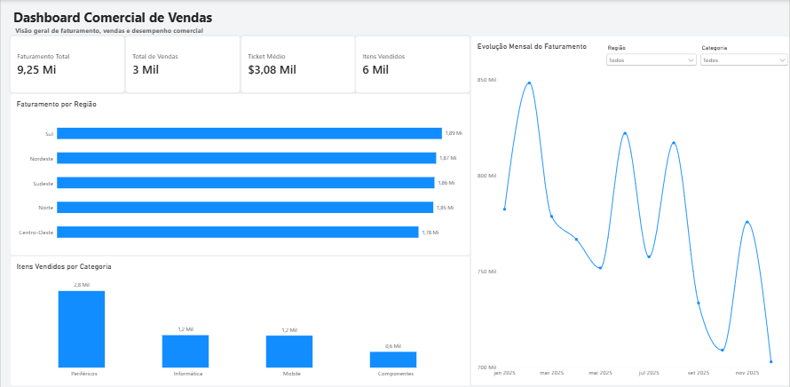

# 📊 Dashboard Comercial de Vendas

Dashboard desenvolvido em **Power BI** para análise de indicadores comerciais e acompanhamento do desempenho de vendas.

O projeto foi criado como parte dos meus estudos em **Análise de Dados e Business Intelligence**, aplicando na prática conceitos de tratamento de dados, criação de indicadores, visualização de informações e construção de dashboards interativos.

---

## 📸 Dashboard

---

## 🎯 Objetivo do projeto

O objetivo deste projeto é transformar dados comerciais em informações visuais que facilitem a análise do desempenho de vendas.

O dashboard permite acompanhar indicadores gerais e analisar os resultados por **região, categoria de produto e período**.

---

## 📈 Indicadores principais

O painel apresenta quatro indicadores de destaque:

- 💰 **Faturamento Total**
- 🛒 **Total de Vendas**
- 🎫 **Ticket Médio**
- 📦 **Itens Vendidos**

---

## 🔎 Análises disponíveis

### Faturamento por Região

Permite comparar o faturamento entre as regiões:

- Sul
- Nordeste
- Sudeste
- Norte
- Centro-Oeste

### Itens Vendidos por Categoria

Apresenta a quantidade de itens comercializados nas categorias:

- Periféricos
- Informática
- Mobile
- Componentes

### Evolução Mensal do Faturamento

Gráfico de linha para acompanhamento da evolução do faturamento ao longo dos meses.

### Filtros interativos

O dashboard possui filtros que permitem analisar os resultados por:

- Região
- Categoria

Ao selecionar um filtro, os indicadores e gráficos são atualizados automaticamente.

---

## 🛠️ Ferramentas utilizadas

- **Microsoft Power BI Desktop**
- Modelagem e organização de dados
- Criação de indicadores
- Visualização de dados
- Gráficos interativos
- Segmentação e filtros
- Formatação de dashboard

---

## 💡 Conhecimentos aplicados

Durante o desenvolvimento deste projeto foram aplicados conceitos de:

- Business Intelligence
- Análise de dados
- Indicadores de desempenho (KPIs)
- Visualização de dados
- Análise temporal de vendas
- Análise por região
- Análise por categoria
- Construção de dashboards interativos

---

## 📂 Arquivos do projeto

- `Dashboard_Comercial_Vendas_Andressa.pbix` — arquivo original do projeto Power BI
- `dashboard.png` — visualização do dashboard
- `README.md` — documentação do projeto

---

## 🚀 Próximas evoluções

Como continuidade do projeto, poderão ser adicionadas:

- Análise de faturamento por canal de vendas
- Comparação entre períodos
- Indicadores de crescimento
- Novas medidas e KPIs
- Página específica para análise de produtos
- Página de análise detalhada de vendas

---

## 👩‍💻 Autora

**Andressa Henrique Teixeira**

🎓 Análise e Desenvolvimento de Sistemas — UNINTER  
🎓 Engenharia de Software — UNIASSELVI  
💻 Foco em **Back-end | Python | APIs | Banco de Dados | Power BI**  
📍 Porto Alegre - RS  
📧 andressahenriqueteixeira@gmail.com

---

⭐ Projeto desenvolvido para fins de estudo e composição de portfólio profissional.
